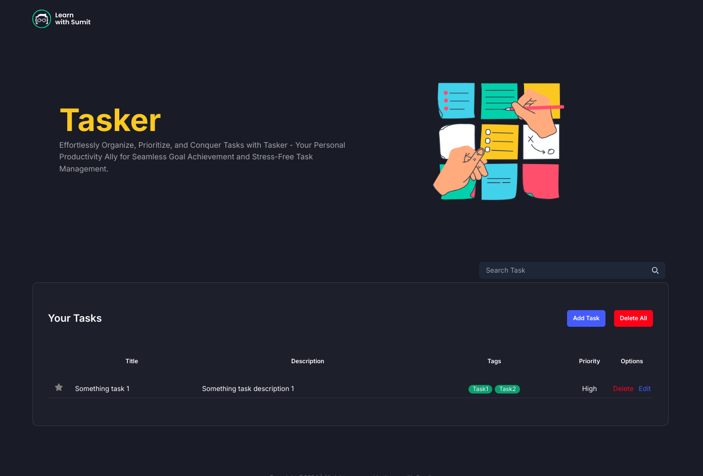
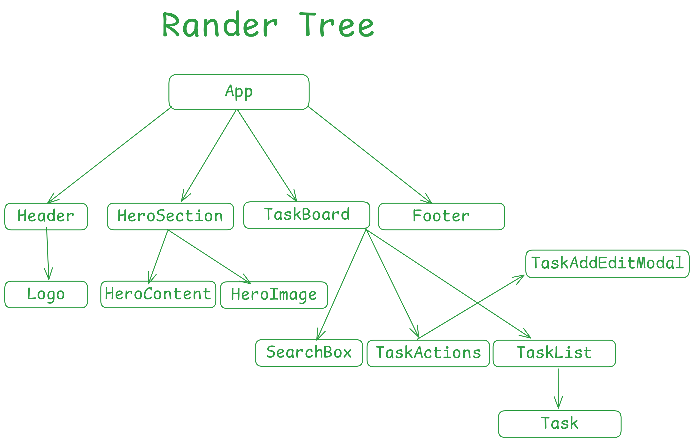
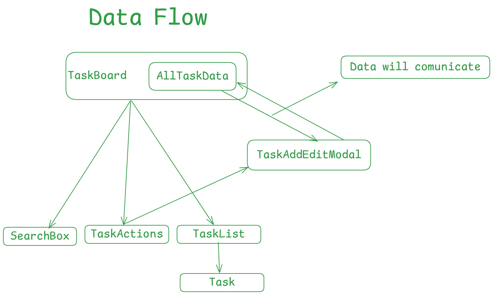

# Tasker - A task management application using ReactJS



## [Live Link](https://dev-tasker.vercel.app/)

## 

## 

### To run this this project

#### Step 1: Create a copy by downloading the project or clone the project

#### Step 2: run this command

        ```bash
            npm install
        ```

        ```bash
            npm run dev
        ```

#### Step 3: Run the local dev server

entering this link to the browser http://localhost:5173/


If you like this project , Hit a star to this repository.


Thank You